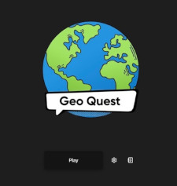
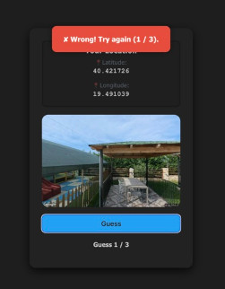

# Geo-Quest
A location-based guessing game built with React, Vite, and Google Maps API. Players select a travel range, get a random location on the map, and earn points by taking a photo as close as possible to the target location.




## Features

- **Random Location Generation**: using Google Maps API
- **Travel Range Selection**: Choose how far you’re willing to travel
- **Scoring System**: Accuracy-based points; the closer your photo is to the target, the higher your score
- **Responsive UI**: built with React and Vite

## Project Structure
```bash
Geo-Quest
├── backend
│   ├── backend
│   │   ├── app.py
│   │   ├── __init__.py
│   │   └── __pycache__
│   │       ├── app.cpython-313.pyc
│   │       └── __init__.cpython-313.pyc
│   ├── main.py
│   ├── Makefile
│   ├── poetry.lock
│   ├── pyproject.toml
│   └── README.md
├── client
│   ├── eslint.config.js
│   ├── index.html
│   ├── Makefile
│   ├── package.json
│   ├── package-lock.json
│   ├── README.md
│   ├── src
│   │   ├── App.css
│   │   ├── App.jsx
│   │   ├── assets
│   │   │   ├── logo-1.jpg
│   │   │   └── logo.png
│   │   ├── Components
│   │   │   ├── LoginModal.css
│   │   │   ├── LoginModal.jsx
│   │   │   ├── MapImage.css
│   │   │   ├── MapImage.jsx
│   │   │   ├── Menu.css
│   │   │   ├── Menu.jsx
│   │   │   ├── RulesPopup.css
│   │   │   ├── RulesPopup.jsx
│   │   │   ├── SettingsPopup.css
│   │   │   ├── SettingsPopup.jsx
│   │   │   ├── Sliders.css
│   │   │   ├── Sliders.jsx
│   │   │   ├── Topbar.css
│   │   │   └── Topbar.jsx
│   │   ├── index.css
│   │   ├── main.jsx
│   │   └── Routes
│   │       ├── Index.css
│   │       ├── Index.jsx
│   │       ├── Play.css
│   │       └── Play.jsx
│   └── vite.config.js
├── data
│   └── users.json
└── Makefile
```

## Tech Stack
- **Frontend**: React, Vite
- **Backend**: Python
